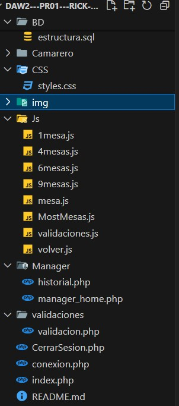

# Proyecto de reserva de mesas de un restaurante

Este proyecto es una aplicacion web que permite a los camareros poder controlar las mesas de un resturante de diferentes salas como terrazas, comedores y salas privadas. La aplicacion esta diseñada utilizando php para la lógica del servidor, JavaScript para las validaciones y aparicion de sweet alerts del lado del cliente  y CSS para el estilo visual, proporcionando una experiencia de usuario intuitiva y dinámica.

## Objetvo del proyecto 

El objetico del proyecto es diseñar una aplicacion plenamente funcional donde el usuario pueda controlar las mesas de un restaurante de manera correcta asegurando la capacidad maxima, ademas la aplicacion permite llevar un control del historico de las mesas des de la pagina del historial el cual podran aceder aquellos usuarios asignados como "Manager" en la base de datos. 
El historial mostrara filtros como las mesas mas usadas, las mesas usadas segun el dia, los camareros asignados en cada mesa, las personas que hay en cada mesa, el limite de ocupaciones en cada mesa y buscar por salas.

## Estructura del proyecto

El proyecto está compuesto por la siguiente estructura de directorios y archivos:

### Descripción de los Archivos y Directorios

1. **Camarero/**
 
 Esta carpeta contiene el proceso logico de cada sala para que aparezcan los diferentes botones y diferentes mesas, tambien contiene el proceso con las consueltas de actualizar el estado de las mesas y obtener su estado para que los botones cambien de color segun si esta desocupado o ocupado.

 - **actualizar_estado.php**: en esta pagina se actualiza el estado de las mesas dependiendo si hay mas ocupantes o si esta libre .
 - **obtener_estado_mesa.php**: en esta pagina se actualiza el estado de las mesas para mantener el color de los botones y la ocupacion de la base 
 - **camarero_home.php**: en esta pagina el camarero podra visualizar las diferentes salas y mesas de todo el restaruante y podra desplazarse entre  ellas de manera dinamica
 - **comedor1.php**: esta pagina corresponde al comedor 1 y sus mesas .
 - **comedor2.php**: esta pagina corresponde al comedor 2 y sus mesas .
 - **privada1.php**: esta pagina corresponde a la sala privada 1 y sus mesas .
 - **privada2.php**: esta pagina corresponde a la sala privada 2 y sus mesas .
 - **privada3.php**: esta pagina corresponde a la sala privada 3 y sus mesas .
 - **privada4.php**: esta pagina corresponde a la sala privada 4 y sus mesas .
 - **terraza1.php**: esta pagina corresponde a la terraza 1 y sus mesas .
 - **terraza2.php**: esta pagina corresponde a la terraza 2 y sus mesas .
 - **terraza3.php**: esta pagina corresponde a la terraza 3 y sus mesas .

 2. **CSS/**

En esta carpeta esta lo que mantiene la parte mas visual del proyecto, los estilos de las diferentes paginas.

- **style.css**: en esta pagina se aplican los estilos de las diferentes salas ya que todas mantienen el mismo estilo ya que se tarta de un resturante por lo tanto es lo mas correcto, tambien esta el estilo de login que es diferente al resto y el estilo de la pagina del historial.

3. **img/**

Esta carpeta contiene las diferentes imagenes de las mesas con las sillas segun su capacidad, son utiles para hacer la aplicacion lo mas visible posible y poder ayudar a el usuario.

4. **js/**
En esta carpeta esta la parte mas intercativa del proyecto hay diferentes apartados de Js con diferentes funciones para mejorar la experiencia del usuario.

 - **1mesa.js**: esta pagina contienen las cordenadas correctas para la mesa con la capacidad de una persona .
 - **4mesas.js**: esta pagina contienen las cordenadas correctas para la mesa con la capacidad de 4 personas .
 - **6mesas.js**:  pagina contienen las cordenadas correctas para la mesa con la capacidad de 6 persona .
 - **9mesas.js**: esta pagina contienen las cordenadas correctas para la mesa con la capacidad de 9 personas .

5. **Manager/**

Esta carpeta muestra lo que sera visible para aquellos usuarios con la ocupacion de "Manager".

 - **historial.php**: en esta pagina se mostrara el historico de las mesas, salas y camareros.
 - **manager_home.php**:en esta pagina el manager tambien podra ocupar y desocupar mesas .

6. **validaciones/**

-**validacion.php**: en esta pagina se encuentra el proceso de validar que los datos del formularis se esten recibiendo, si los usuarios y las contraseñas con acordes a las ingresdas en la base de datos y segun que tipo de usuario redirigir al apartado de manager o camarero.

-**CerrarSesion.php**: esta pagina permite cerrar sesion al usuario cuando acabe de hacer su tarea, asi el proximo usuario podra logearse a con su propio usario.

-**index.php**: en esta pagina se crea el login con sus respectivos campos, usuario  y contraseña para acceder a la pagina correspondiente .

-**conexion.php**:en esta pagina se hace la conexion a la base de datos.

## Autores

- **Nombre del autor**: Aina Orozco, David Alvarez, Pol Marc, Deiby Buenaño